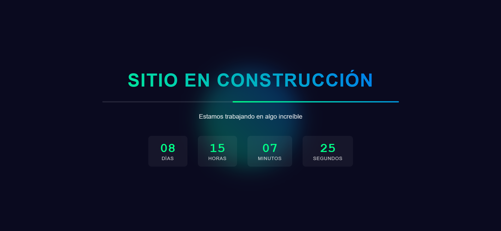

  <h2 align="center">Tiempo de Construcción - Website</h2>

  Sitio web que muestra el tiempo transcurrido para levantar un proyecto web empresarial.   Adaptable a todos los dispositivos, creado con HTML, CSS, JavaScript y Json.
  
**Tecnologías utilizadas en el proyecto:**  

  <a href="https://enzomenchise2525.github.io/construccion/"><strong>➥ Live Demo</strong></a>

### Demo Screeshots

 